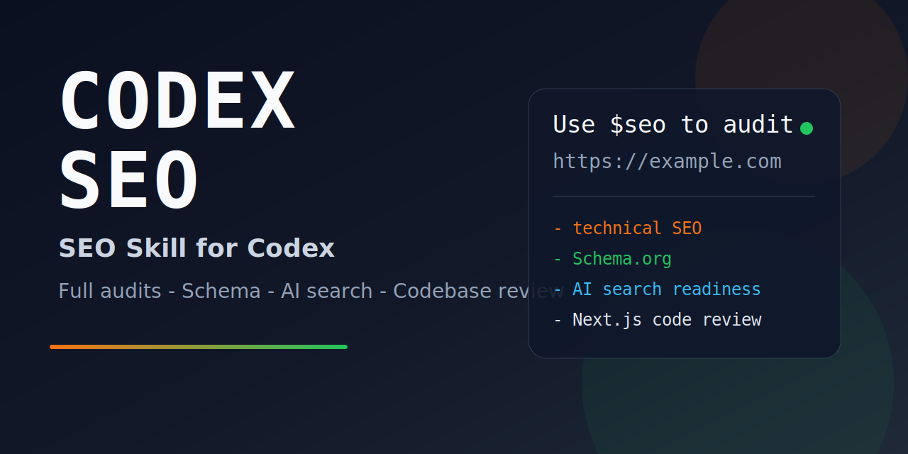

<p align="center">
  
</p>

# Codex SEO - SEO Audit Skill for Codex

Comprehensive SEO skill for Codex. Review live websites, single pages, technical SEO, Schema.org, AI search readiness, local SEO, and website codebases before launch.

[](https://github.com/Luzikov/codex-seo-skill)
[](https://github.com/Luzikov/codex-seo-skill)
[](./LICENSE)

## Table of Contents

- [What This Is](#what-this-is)
- [Who It Is For](#who-it-is-for)
- [Installation](#installation)
- [Quick Start](#quick-start)
- [What To Paste Into Codex](#what-to-paste-into-codex)
- [What The Skill Covers](#what-the-skill-covers)
- [What You Can Hire Me For](#what-you-can-hire-me-for)
- [Contact](#contact)
- [Repository Layout](#repository-layout)
- [Documentation](#documentation)
- [Requirements](#requirements)
- [Uninstall](#uninstall)
- [License](#license)

## What This Is

This repository contains a complete SEO skill for Codex.

It is built to help with:

- full website SEO audits;
- single-page reviews;
- technical SEO checks;
- content quality and trust review;
- Schema.org review;
- AI search readiness;
- local SEO;
- source-code SEO review for projects like Next.js before launch.

The goal is simple: give Codex enough structure to produce useful SEO output fast, clearly, and without outdated advice.

## Who It Is For

This skill is useful for:

- founders shipping a new website;
- freelancers and agencies doing audits;
- developers who want SEO checks before launch;
- SaaS teams, ecommerce teams, and local businesses;
- people who want a practical SEO review, not vague theory.

## Installation

### Recommended Install (Unix/macOS/Linux)

Clone directly into your Codex skills directory:

```bash
git clone --depth 1 https://github.com/Luzikov/codex-seo-skill.git ~/.codex/skills/seo
```

### Windows (PowerShell)

```powershell
git clone --depth 1 https://github.com/Luzikov/codex-seo-skill.git "$env:USERPROFILE\.codex\skills\seo"
```

### Update Existing Install

Unix/macOS/Linux:

```bash
git -C ~/.codex/skills/seo pull
```

Windows (PowerShell):

```powershell
git -C "$env:USERPROFILE\.codex\skills\seo" pull
```

## Quick Start

Important:

- this skill is used with prompts inside Codex;
- you do **not** use Claude-style slash commands like `/seo audit`;
- in Codex, you call the skill with `$seo`.

Basic flow:

1. Open Codex.
2. Paste one of the prompts below.
3. Get a clear SEO review and fix plan.

Example:

```text
Use $seo to audit https://example.com and return a simple fix plan.
```

## What To Paste Into Codex

These are the easiest prompts to start with.

### 1. Full Website Audit

Paste:

```text
Use $seo to run a full SEO audit for https://example.com.
```

You get:

- short diagnosis;
- top problems by priority;
- quick wins;
- 1-2 week fix plan;
- review limits if the audit used only a sample of pages.

### 2. Single Page Review

Paste:

```text
Use $seo to review the SEO of https://example.com/pricing.
```

You get:

- title and meta review;
- heading and URL review;
- canonical and indexing checks;
- content and trust review;
- page-level fix suggestions.

### 3. Technical SEO Review

Paste:

```text
Use $seo to check robots.txt, sitemap.xml, canonicals, redirects, and indexing issues on https://example.com.
```

You get:

- crawl and indexing problems;
- duplicate and canonical problems;
- sitemap and robots findings;
- technical fix priorities.

### 4. Schema Review

Paste:

```text
Use $seo to validate schema markup on https://example.com and show what is missing.
```

You get:

- detected schema types;
- broken or missing fields;
- safer schema recommendations;
- ready direction on what to add or fix.

### 5. AI Search Readiness Review

Paste:

```text
Use $seo to review whether https://example.com is ready for AI search and llms.txt guidance.
```

You get:

- AI bot access review;
- llms.txt guidance;
- citation-readiness feedback;
- content structure suggestions for AI answers.

### 6. Local SEO Review

Paste:

```text
Use $seo to review local SEO for this clinic website and tell me what to fix first.
```

You get:

- location-page quality review;
- local trust-signal review;
- LocalBusiness schema guidance;
- local SEO priorities.

### 7. Codebase SEO Review

Paste:

```text
Use $seo to review my Next.js codebase for SEO issues before launch.
```

You get:

- metadata review;
- sitemap and robots review;
- canonical and indexing review;
- schema and rendering review;
- code-level SEO issues to fix before production.

### 8. SEO Strategy Plan

Paste:

```text
Use $seo to create an SEO plan for a SaaS company.
```

You get:

- page priorities;
- content direction;
- schema priorities;
- SEO structure guidance;
- a practical roadmap instead of generic advice.

## What The Skill Covers

### Full Audits

- representative website audits with prioritized fixes;
- homepage, money-page, content-page, robots, and sitemap review flow;
- practical output focused on what to fix first.

### Technical SEO

- crawlability and indexability;
- redirects, canonicals, noindex, duplicate URLs;
- HTTPS and technical hygiene;
- current Core Web Vitals logic with `LCP`, `INP`, `CLS`.

### Content Quality

- intent match;
- experience and proof;
- author visibility and trust;
- weak, generic, or mass-generated copy detection.

### Schema.org

- `JSON-LD`-first recommendations;
- type validation;
- required-field review;
- outdated markup guardrails.

### AI Search Readiness

- `GPTBot`, `OAI-SearchBot`, `ChatGPT-User`, `ClaudeBot`, `PerplexityBot`;
- `/llms.txt` guidance;
- answer-block and citation-readiness checks.

### Local SEO

- location-page quality checks;
- local trust-signal review;
- `LocalBusiness` guidance;
- safeguards against doorway-style scaling mistakes.

### Source-Code SEO Review

- Next.js and similar framework review before launch;
- metadata, sitemap, robots, canonicals, schema, and rendering checks;
- code-level SEO mistakes that often slip through before deployment.

### SEO Strategy Templates

Built-in templates for:

- SaaS
- local business
- ecommerce
- publisher
- agency
- general business

## What You Can Hire Me For

If you want help beyond the free skill, I can adapt or apply it for real projects.

Paid help can include:

- Codex skill installation and setup;
- custom SEO skill adaptation for your niche or website;
- live website SEO audit with action plan;
- pre-launch Next.js or web-app SEO review;
- custom report templates and prompt packs;
- ongoing improvement and support.

## Contact

If you want setup help, a custom version, or a paid audit:

- GitHub profile: [@Luzikov](https://github.com/Luzikov)
- Issues: [open an issue](https://github.com/Luzikov/codex-seo-skill/issues)

## Repository Layout

```text
.
|-- SKILL.md                     # Main skill instructions and workflow
|-- README.md                    # Repository landing page
|-- agents/
|   `-- openai.yaml              # UI metadata for Codex
|-- references/
|   |-- core-web-vitals.md       # Current performance metrics and rules
|   |-- eeat.md                  # Content quality and trust review guide
|   |-- geo-ai-search.md         # AI search readiness checks
|   |-- local-seo.md             # Local SEO review guidance
|   |-- quality-gates.md         # Thin-content and scale guardrails
|   |-- schema-types.md          # Schema recommendations and restrictions
|   `-- source-code-seo.md       # Codebase SEO review workflow
|-- assets/
|   |-- saas-plan.md
|   |-- local-service-plan.md
|   |-- ecommerce-plan.md
|   |-- publisher-plan.md
|   |-- agency-plan.md
|   |-- generic-plan.md
|   `-- readme-banner.svg
`-- LICENSE
```

## Documentation

Core files:

- [SKILL.md](./SKILL.md)
- [agents/openai.yaml](./agents/openai.yaml)

Reference files:

- [references/core-web-vitals.md](./references/core-web-vitals.md)
- [references/eeat.md](./references/eeat.md)
- [references/geo-ai-search.md](./references/geo-ai-search.md)
- [references/local-seo.md](./references/local-seo.md)
- [references/quality-gates.md](./references/quality-gates.md)
- [references/schema-types.md](./references/schema-types.md)
- [references/source-code-seo.md](./references/source-code-seo.md)

Planning templates:

- [assets/saas-plan.md](./assets/saas-plan.md)
- [assets/local-service-plan.md](./assets/local-service-plan.md)
- [assets/ecommerce-plan.md](./assets/ecommerce-plan.md)
- [assets/publisher-plan.md](./assets/publisher-plan.md)
- [assets/agency-plan.md](./assets/agency-plan.md)
- [assets/generic-plan.md](./assets/generic-plan.md)

## Requirements

- Codex with local skill support
- Git for install and updates
- Internet access for live-site audits
- Optional: a local web project for pre-launch codebase SEO reviews

Python is not required for normal usage of the skill itself.

## Uninstall

Unix/macOS/Linux:

```bash
rm -rf ~/.codex/skills/seo
```

Windows (PowerShell):

```powershell
Remove-Item "$env:USERPROFILE\.codex\skills\seo" -Recurse -Force
```

## License

MIT License. See [LICENSE](./LICENSE).

---

Built for Codex by [@Luzikov](https://github.com/Luzikov)
